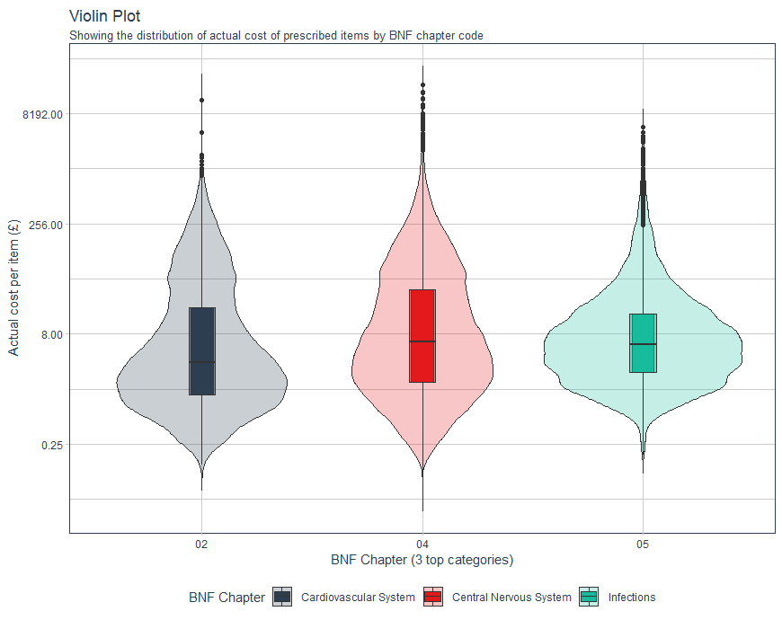

# Visualisations
 
This is a repo for the scripts for different visualisations. Could be used as a template to build similar plots in the future.

## Boxplots

Blood test boxplots. This plot shows the most common blood test results with the window for the “normal” values for a healthy individual.

[ Here is the code ](Boxplots/Boxplots_published.R)

## Maps

Two maps comparing the indexes of freedom in the World. The idea comes from #TidyTusday project and the data comes from Freedom House and the United Nations.

[ Here is the code ](Maps_2022_03_TidyTuesday/Map_freedom_index_published.R)

## Word cloud

It is an image of a cloud of words about data science.

[ Here is the code ](wordcloud/wordcloud_script.R)

## Violin plot

It represents the distribution of actual cost of prescribed in hospitals and dispensed in the community medicines.
Data from January 2022, NHS open prescription data.

[ Here is the code ](violin_plot/Violin_plot_hosp_prescrip.R)

